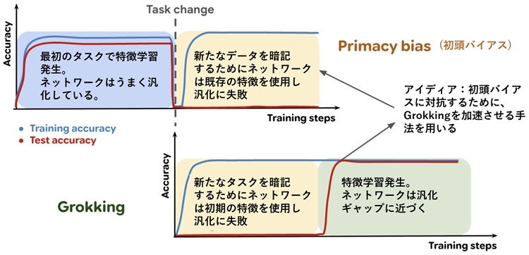

<html lang="ja">
    <head>
        <meta charset="utf-8" />
    </head>
    <body>
        <h1>
Trend Watching: Grokking
</h1>
        <h2>なにものか？</h2>
        

素人が野次馬的に Grokking の研究動向を眺めてみることにした。
        

<h3>Grokking とは</h3>

機械学習モデルがトレーニングデータを暗記して、十分に一般化できないものの、長期間のトレーニング後に突然ほぼ完璧な一般化に移行する現象のこと。

日本語の「腑に落ちる」「腹落ちする」に該当するそうで、何故か興味がある。 
「Grokking」という用語は、ロバート・ハインラインのSF小説「異星の客」から借りてきたものとのこと(未読) 
 Grokking: Generalization Beyond Overfitting on Small Algorithmic Datasets（小さなアルゴリズムデータセットにおける過適合を超えた一般化) 
  
 より広範な研究テーマとして『Memorization to Generalization』(記憶(暗記)から汎化へ)というものがあるらしい。 
・『Memorization to Generalization: Emergence of Diffusion Models from Associative Memory』(2025) 
　(記憶から汎化へ：連想記憶からの拡散モデルの創発) 
・『Diffusion probabilistic models generalize when they fail to memorize』(2023) 
　　(拡散確率モデルは暗記に失敗すると汎化する) 
  など

<h3>動向</h3>

たぶん、こんな感じ。

 

<ul><li>
<a href="https://arxiv.org/html/2601.19791v1">Grok Grokking: リッジ回帰における証明可能なGrokking</a> (2026) 
   ・我々は、古典的なリッジ回帰設定において、グロッキング（過学習のかなり後になって現れる汎化の始まり）を研究する。 
･･･ 
私たちの研究結果は、グロッキングはディープラーニングの固有の障害モードではなく、特定のトレーニング条件の結果であり、それを回避するにはモデルアーキテクチャや学習アルゴリズムに根本的な変更を加える必要がないことを示唆しています。 

</li> <li>
    
<a href="https://arxiv.org/abs/2510.04930v1">Egalitarian Gradient Descent: A Simple Approach to Accelerated Grokking</a> (2025) 
　(平等勾配降下法：加速グロッキングへのシンプルなアプローチ) 
　・（確率的）勾配降下法の速度が、勾配の異なる主方向（すなわち、特異方向）に沿って非対称になることで、グロッキングが誘発されることを、経験的かつ理論的に示す。 
　・次に、勾配を正規化し、すべての主方向に沿ったダイナミクスが全く同じ速度で進化するようにする、単純な修正法を提案する。 
　・この修正法 (我々は平等主義勾配降下法（EGD）と呼び、<strong>自然勾配降下法を慎重に修正した形式と見なすことができる</strong>) が、<strong>はるかに高速にグロッキングする</strong>ことを確立する。
 
</li> <li>
     
<a href="https://arxiv.org/abs/2509.17738">Flatness is Necessary, Neural Collapse is Not: Rethinking Generalization via Grokking</a> 
平坦性は必要だが、ニューラルコラプスは不要：グロッキングによる汎化の再考 
ニューラルコラプスと損失ランドスケープの平坦性は理論的にも経験的にも汎化と結び付けられてきた。しかし、どちらの現象の因果関係も依然として不明だった。グロッキングを用いてこれらの疑問を解明した。
ニューラルコラプスと相対的平坦性はどちらも汎化の開始時に出現するが、平坦性のみが一貫して汎化を予測できることが分かった。 
グロッキングが幾何学的基礎を分離するための強力なプローブとしてどのように機能するかを実証した。 
</li> <li>
<a href="https://www.arxiv.org/abs/2508.04401">Why are LLMs' abilities emergent?</a> 
LLM の能力はなぜ出現するのでしょうか? 
AIによる要約は<a href="https://www.alphaxiv.org/ja/overview/2508.04401v1">こちら</a>

</li> <li>
<a href="https://arxiv.org/abs/2507.23346">Transfer entropy and O-information to detect grokking in tensor network multi-class classification problems</a> 
テンソルネットワークの多クラス分類問題における グロッキング 検出のための転送エントロピーとO情報量
    
</li> <li>
<a href="https://arxiv.org/abs/2507.20057">What Can Grokking Teach Us About Learning Under Nonstationarity?</a> 
[8] 非定常状態での学習について グロッキングから 何が学べるか? 
機械翻訳は<a href="https://boyoyon.github.io/HTMLs_translated_to_Japanese/2025_WHAT%20CAN%20GROKKING%20TEACH%20US%20ABOUT%20LEARNING/WHAT%20CAN%20GROKKING%20TEACH%20US%20ABOUT%20LEARNING%20UNDER%20NONSTATIONARITY.html">こちら</a> 

<a href="https://x.com/clarelyle">https://x.com/clarelyle</a> 
グロッキングと可塑性には何が共通しているのでしょうか？
グロッキングを促進するのと同じ根底にあるメカニズムが、非定常な状況におけるプライマシーバイアスを軽減するのに役立つという論文があります。<strong>言い換えれば、グロッキングできれば、継続的に学習できるということです！</strong> 
 
既存の技術を使ってGrokkingを速めるのかと思ったら反対だった (Grokking高速化の手法で初頭バイアスに打ち勝つ)。 
継続学習させるのも興味深いが･･･(機械学習が守破離を身につけるような話?)
</li></ul>

プライマシーバイアス（上段）とグロッキング（下段）はどちらも、特徴学習の欠如（黄色）によりネットワークの汎化能力が低下する期間を示しています。プライマシーバイアスでは、これは初期トレーニングフェーズで学習した不適切な特徴（青）が原因です。グロッキングでは、ネットワークは最終的に特徴学習のダイナミクス（緑）を回復し、汎化能力を発揮します。

<ul><li>

<a href="https://arxiv.org/abs/2507.11645">Tracing the Path to Grokking: Embeddings, Dropout, and Network Activation</a> 
Grokking への道筋を辿る：埋め込み、ドロップアウト、ネットワーク活性化 
AIによる要約は<a href="https://www.alphaxiv.org/ja/overview/2507.11645v1">こちら</a>

</li> <li>
<a href="https://arxiv.org/abs/2506.04434">Grokking and Generalization Collapse: Insights from HTSR theory</a> 
Grokkingと一般化の崩壊: HTSR 理論からの洞察 
AIによる要約は<a href="https://www.alphaxiv.org/ja/overview/2506.04434v1">こちら</a>
    
</li> <li>
<a href="https://arxiv.org/abs/2507.05644">FACT: the Features At Convergence Theorem for neural networks</a> 
事実：ニューラルネットワークの収束定理の特徴 
AIによる要約は<a href="https://www.alphaxiv.org/overview/2507.05644v1">こちら</a>

</li> <li>
<a href="https://arxiv.org/abs/2506.23679">Learning Modular Exponentiation with Transformers</a> 
Transformerを使ったモジュラー指数の学習
    
</li> <li>
<a href="https://arxiv.org/abs/2506.23286">Not All Explanations for Deep Learning Phenomena Are Equally Valuable</a> 
ディープラーニング現象に対するすべての説明が同等に価値があるわけではない 
AIによる要約は<a href="https://www.alphaxiv.org/ja/overview/2506.23286v1">こちら</a>

</li> <li>
<a href="https://www.arxiv.org/abs/2507.19680">Feature learning is decoupled from generalization in high capacity neural networks</a> 
大容量ニューラルネットワークでは、特徴学習は一般化から切り離されている

</li> <li>
<a href="https://arxiv.org/abs/2506.11015">The Memory Paradox: Why Our Brains Need Knowledge in an Age of AI</a> 
記憶のパラドックス：AI時代に脳が知識を必要とする理由

</li> <li>
<a href="https://arxiv.org/abs/2506.21551">Where to find Grokking in LLM Pretraining? Monitor Memorization-to-Generalization without Test</a> 
LLM事前学習でGrokkingを見つけるには？テストなしで記憶から一般化への変化をモニタリング 
AIによる要約は<a href="https://www.alphaxiv.org/ja/overview/2506.21551v1">こちら</a>

</li> <li>
<a href="https://arxiv.org/abs/2504.17243">NeuralGrok: Accelerate Grokking by Neural Gradient Transformation</a> 
NeuralGrok: ニューラル勾配変換による Grokking の高速化 
AIによる要約は<a href="https://www.alphaxiv.org/ja/overview/2504.17243v1">こちら</a>

</li> <li>
ResNet-18でGrokkingを再現させるコードが公開されている。
<a href="https://github.com/Qihuai27/Grokking-Insight">https://github.com/Qihuai27/Grokking-Insight</a> 
(私の環境だと学習済ResNet-18パラメータのダウンロードに失敗し動作未確認)
</li> <li>
[7] 埋め込み層からの Grokking のメカニズム的洞察 
AIによる要約は<a href="https://www.alphaxiv.org/ja/overview/2505.15624v1">こちら</a> 
機械的分析により、ニューラルネットワークにおけるグロッキング現象の主な要因が埋め込み層であることが明らかになりました。
本研究では、埋め込みパラメータに異なる学習率を適用するAdam-LRという改良されたオプティマイザを提案しており、これにより更新量のバランスを取り、初期化に対する感度を緩和することで、グロッキングを加速させます。
    
</li> <li>
[6] GrokAlign: グロッキングの幾何学的特徴付けと高速化 
AIによる要約は<a href="https://www.alphaxiv.org/ja/overview/2506.12284v1">こちら</a> 
グロッキングの遅延汎化とロバストネスという二重の側面を統一する、初のメカニズム的説明を提供します。
</li> <li>
[4] Let Me Grok for You: Accelerating Grokking via Embedding Transfer from a Weaker Model (2025) 
AIによる要約は<a href="https://www.alphaxiv.org/ja/overview/2504.13292v1">こちら</a> 
 
GrokTransferはまず、より小さく弱いモデルをトレーニングし、自明ではない（しかし最適には程遠い）テスト性能に到達させます。次に、この弱いモデルから学習された入力埋め込みを抽出し、ターゲットとなるより強力なモデルへの埋め込みを初期化するために使用します。 
 
<strong>弱いモデルから強いモデルへの知識伝達の原則に基づいており、より単純なモデルからの洞察が、より複雑なモデルの学習をブートストラップできます。</strong> 
 
(「知識蒸留」は強いモデル(教師モデル)の知識を使って、弱いモデル(生徒モデル)の学習を支援するけど、その逆ってこと? 面白い。)
</li> <li>
[5] Where to find Grokking in LLM Pretraining? Monitor Memorization-to-Generalization without Test (2025) 
AIによる要約は<a href="https://www.alphaxiv.org/ja/overview/2506.21551v1">こちら</a> 
大規模言語モデル（LLM）の実用的な大規模事前学習において、グロッキングは発生するのでしょうか？
小規模モデルで見られたグローバルで同期的なグロッキングとは異なり、LLMのグロッキングは<strong>局所的かつ非同期</strong>であることを発見した。

</li> <li>
GROKKING AT THE EDGE OF NUMERICAL STABILITY (数値的安定性の限界を突き止める) (2025) 
・グロッキングなしで過剰適合するケースは、浮動小数点エラーが極端な値によって引き起こされる。 
　これをソフトマックス崩壊 (SC) と呼ぶ 。 
・SCを回避するための介入、例えば浮動小数点精度の向上や数値的に安定したSoftmaxの新しいバージョン 
（ステーブルマックス）、正規化なしではこれまで存在しなかった設定でグロッキングが発生する 
・過剰適合と交差エントロピー損失がモデルを制御されていないロジット成長の方向に押し進めるため、 
　モデルがSCに近づくことがわる。これをナイーブ損失最小化（NLM）と呼ぶ 
・新しい最適化手法によってNLMを回避できることを実証した(⟂Grad)  

 
    
113を法とする加算タスクで得られた結果

</li> <li>
[3] Grokfast: Accelerated Grokking by Amplifying Slow Gradients (2024) 
AIによる要約は<a href="https://www.alphaxiv.org/ja/overview/2405.20233v2">こちら</a> 
Grokfastは、勾配の低周波成分を選択的に増幅することにより、グロッキングとして知られる遅延汎化現象を、さまざまな深層学習タスクにおいて最大50倍加速させる。

</li> <li>
[2]Unified View of Grokking, Double Descent and Emergent Abilities: A Perspective from Circuits Competition　(2023) 
AIによる要約は<a href="https://www.alphaxiv.org/ja/overview/2402.15175v2">こちら</a>

</li> <li>
Explaining grokking through circuit efficiency (2023) 
 
-「訓練データをそのまま記憶する回路」と「データの背後にある普遍的なパターンを学習する汎化回路」という、2種類の解法が存在する。 
- 記憶回路は学習が速い一方で非効率的であり、汎化回路は学習が遅いがより効率的 
- 学習の初期段階では、より早く形成される非効率な記憶回路が優位になるため、モデルは訓練データを暗記する。 
- 訓練が長期間続くにつれて、「重み減衰（weight decay）」などの効果により,効率的な汎化回路が徐々に形成され、最終的に記憶回路に取って代わる。この移行が完了したときに、モデルの汎化能力が劇的に向上し、Grokkingとして観察される 

</li> <li>
Grokking as the Transition from Lazy to Rich Training Dynamics 
グロッキング：怠惰な訓練ダイナミクスから豊かな訓練ダイナミクスへの移行(2023) 
AIによる要約は<a href="https://www.alphaxiv.org/ja/overview/2310.06110v3">こちら</a> 

ニューラルネットワークにおけるグロッキング現象を、初期の「怠惰な(lazy)」訓練フェーズから「豊かな(rich)」特徴学習フェーズへの移行として説明 

異なる学習ダイナミクスが異なる解にどのように導くかを示す概念図。青いパスはグロッキングを表しており、ネットワークは初期にはレイジーな学習軌道（初期化に近い状態を保つ）をたどり、その後リッチな特徴学習へと移行する
 

</li> <li>
[1] Bridging Lottery ticket and Grokking: Is Weight Norm Sufficient to Explain Delayed Generalization? (2023)　 
東大松尾研　日本語版は<a href="https://www.jstage.jst.go.jp/article/pjsai/JSAI2024/0/JSAI2024_1B4GS203/_pdf/-char/ja">こちら</a>

</li> <li>
[0] Grokking: Generalization beyond overfitting on small algorithmic datasets (2022) 
最初に「グロッキング」現象を発見し、命名し、調査した論文 
AIによる要約は<a href="https://www.alphaxiv.org/ja/overview/2201.02177v1">こちら</a> 
機械翻訳は<a href="https://boyoyon.github.io/HTMLs_translated_to_Japanese/2022_GROKKING%20-%20GENERALIZATION%20BEYOND%20OVERFITTING%20ON%20SMALL%20ALGORITHMIC%20DATASETS/GROKKING%20-%20GENERALIZATION%20BEYOND%20OVERFITTING%20ON%20SMALL%20ALGORITHMIC%20DATASETS.html">こちら</a>
</li></ul>

    </body>
</html>
